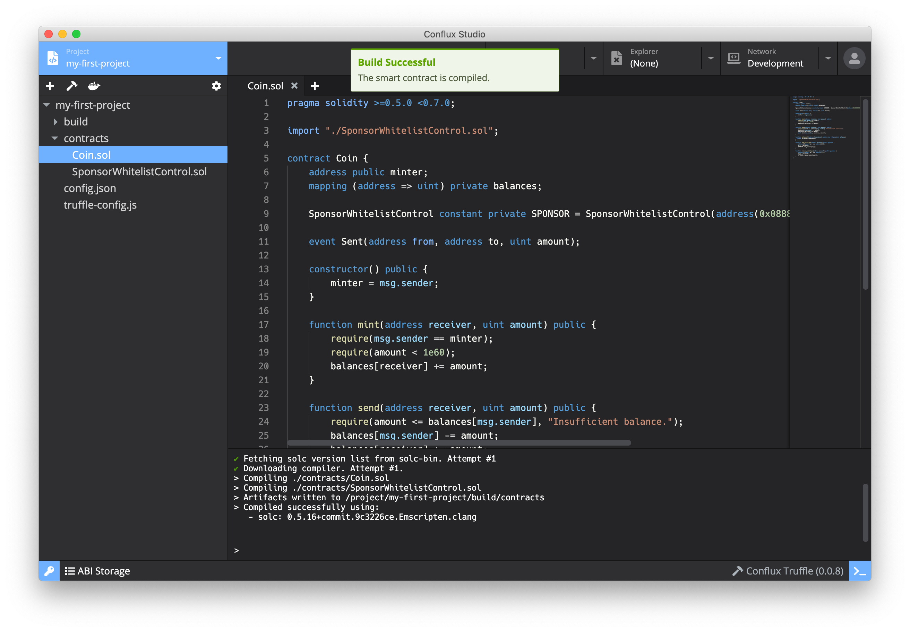

# Conflux Studio

Conflux Studio 是一个帮助开发者快速开发 [Conflux](https://confluxnetwork.org/) 网络的集成化开发环境。

## 安装

### 下载

Conflux Studio 安装包可以在 [Github Releases](https://github.com/ObsidianLabs/ConfluxStudio/releases) 进行下载。

### 安装

双击打开 `ConfluxStudio-0.1.1.dmg` 并将 `Conflux Studio` 拖动到应用文件夹内。

## 功能预览

### 准备工作

在正确安装 Conflux Studio 并初次启动时，你将看到一个欢迎页面，这里有 Conflux Studio 正常运行所需要的依赖，包括了 Docker，Conflux Node 以及 Conflux Truffle

  

- **Conflux Studio** 使用 [**Docker**](https://www.docker.com/) 来启动 Conflux 节点和进行项目编译。如果你之前没有安装过 Docker，可以点击 *Install Docker* 按钮访问 Docker 官方网站并进行下载安装。
- [**Conflux Node**](https://github.com/Conflux-Chain/conflux-rust) 是 Conflux 官方提供的 Docker 镜像，Conflux Studio 使用这个镜像来运行 Conflux 节点以及项目编译
- [**Conflux Truffle**](https://github.com/Conflux-Chain/conflux-truffle) 是 Conflux 的开发工具包，Conflux Studio 使用这个工具包进行项目的创建和编译。

当所有依赖都正确安装并运行后，灰色的 *Skip* 按钮将会变成绿色的 *Get Started* 按钮。点击这个按钮进入 Conflux 的主界面。

### 创建密钥对

进入主界面后，我们首先创建一些密钥对。在 Conflux Studio 的任意界面，你都可以通过点击左下角的钥匙按钮来打开密钥管理器。

  

你可以在密钥管理器中创建、导入和删除密钥对。在创建和编辑密钥对的时候，你可以为该密钥对设置别名，方便在后续的使用中进行识别。密钥管理器除了对密钥对进行储存管理外，还将为创世区块提供创世地址。创建实例时，创世区块获取密钥管理器中的所有公钥并将这些密钥作为创世地址。

我们在密钥管理器中创建两个新的密钥对，这两个密钥对将作为后文中节点的创世地址。

### 启动节点

点击顶部的 *Network* 标签，主页面将切换为网络管理器。在网络管理器中，我们可以进行 Conflux 节点版本和节点实例的管理，包括下载、删除 Conflux 节点版本，根据不同版本创建、删除和运行节点实例。

点击主页面中右上角的 *New Instance* 按钮打开创建新实例的弹窗，填写实例名称和选择合适的版本，点击 *Create* 按钮完成节点实例的创建。

  

节点实例创建完成后，实例列表将显示刚刚创建好的实例，点击实例的绿色 *Start* 按钮启动 Conflux 节点。启动完成后，你可以在下方的日志查看器中检查节点运行日志。

  

### 区块浏览器

节点启动后，点击顶部的 *Explorer* 标签，主页面将切换为区块浏览器。在区块浏览器中，我们可以查询对应地址的余额。

从密钥管理器中复制刚刚生成的地址，将地址粘贴在地址栏并点击回车，我们便可以看到对应地址的余额信息了。

  

### 创建智能合约项目

点解顶部的 *Project* 标签，主页面将切换至项目管理器。

点击页面右上角的 *New* 按钮打开创建项目弹窗，输入项目名称并选择合适的模版，Conflux Studio 提供了 `coin` 和 `[Truffle] metacoin` 两种模版。点击 *Create Project* 按钮创建项目。

  

项目创建完成后，主页面将切换至项目编辑器。项目编辑器由几个部分组成，包括了文件浏览器，代码编辑器，工具栏，日志查看器等多个开发常用模块。

### 编译智能合约项目

点击工具栏的编译按钮（锤子形状），Conflux Studio 将进行项目的编译，你可以通过下方的日志查看器来查看编译结果。编译后将在项目目录下的 *build* 文件夹中生成 json 文件。

  

### 部署智能合约项目

点击工具栏的部署按钮（船形状），Conflux Studio 将进行项目部署，部署结果将会弹窗显示。

  

### 合约浏览器

成功部署智能合约后，点击弹窗中点击蓝色的 *contract* 按钮，主页面将切换至合约浏览器，Conflux Studio 将自动打开刚才部署完成的智能合约。

合约浏览器页面主要分为两个部分：
 - 左边为合约的调用方法，点击左半部分的左上角蓝色按钮弹出的下拉框显示当前合约所定义的方法，点击方法名称可以切换调用的方法。
 - 右边为合约的数据读取，点击右半部分的左上角蓝色按钮弹出的下拉框显示当前合约的数据表，点击表名称可以切换查看不同表中的数据。

  

接下来我们使用部署好的合约创建 *coin*。选择 *mint* 方法，在 *Parameters* 下填入 *receiver* 地址（可以从密钥管理器中复制）和在 *amount* 中填入合适的数量，在 *Authorization* 中填入创世地址，点击上方的执行按钮。完成交易后，我们可以在左下角的 *Result* 中看到成功执行的结果。此时我们已经创建了新的 *coin*。

在右边的 *balance* 表中，在 Parameters 下输入刚刚填入的 *receiver* 地址，点击执行按钮，便可以看到刚刚 *mint* 的总数了。

  

